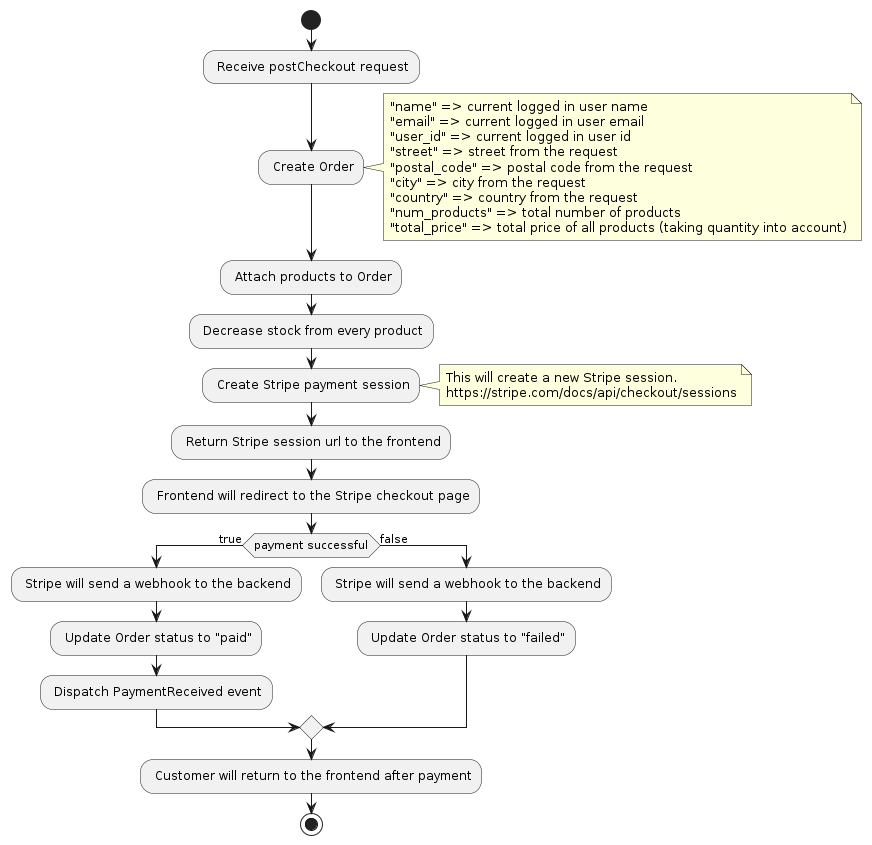

# Webshop Package

This is a Laravel 10 package that provides you with an API to handle a simple webshop powered by Stripe.

## Todo

- [ ] Product version support (multi-variant products)

## Installation

#### Package

```sh
composer require raw-focus/webshop:^1.0
```

#### Environment file

Add the following entries to your `.env` file:
```
# Your Stripe API key
STRIPE_PRIVATE_KEY=

# Your Stripe success & fail URLS where your customer will be redirected to. The endpoints are appended with the /:order-id
STRIPE_SUCCESS_URL=http://localhost:5173/webshop/checkout/succeeded
STRIPE_CANCEL_URL=http://localhost:5173/webshop/checkout/failed
```

#### Database

After installing the package you should migrate the package's migration files with:
```sh
php artisan migrate
```

We have defined some seeders for testing purposes which you can publish, edit and use yourselves with:
```sh
php artisan vendor:publish --tag=webshop-seeders
```

Then add the seeders to your `database\seeders\DatabaseSeeder.php` file:
```php
<?php

namespace Database\Seeders;

...

use RawFocus\Webshop\database\seeders\OrderSeeder;
use RawFocus\Webshop\database\seeders\ProductSeeder;

...

class DatabaseSeeder extends Seeder
{
    public function run()
    {
        ...

        $this->call(ProductSeeder::class);
        $this->call(OrderSeeder::class);
    }
}
```

#### Configuration

Publish the config file with:
```sh
php artisan vendor:publish --tag=webshop-config
```

#### Language files

Publish the language files with:
```sh
php artisan vendor:publish --tag=webshop-lang
```
 
## Usage

The package primarily provides you with a `Product` and `Order` model and an API that you can use to manage those products & orders.

For all actions that are performed **events** are fired which you can listen for in your application. The package does not provide any email sending or other consequences that usually happen after for example placing an order. So it's up to you to build that functionality yourself.

## Models

The following models are provided by the package:

```
Product > ProductVariant > ProductVariantOption
        > ProductImage

Order` > OrderProduct
```

## API Endpoints

- `GET` `api/webshop/data`

- `POST` `api/webshop/checkout`
- `POST` `api/webshop/checkout/retry`

- `GET` `api/webshop/products`
- `GET` `api/webshop/products/find-by-id/{slug}`
- `GET` `api/webshop/products/find-by-slug/{slug}`
- `POST` `api/webshop/products/create`
- `POST` `api/webshop/products/update`
- `POST` `api/webshop/products/delete`

- `GET` `api/webshop/orders`
- `GET` `api/webshop/orders/find-by-id/{id}`
- `GET` `api/webshop/orders/find-by-uuid/{uuid}`
- `POST` `api/webshop/orders/flag-as-shipped`
- `POST` `api/webshop/orders/flag-as-arrived`

- `POST` `api/webshop/stripe/endpoint`

## Security

You can specify the `middleware` you want to protected your routes with in the `webshop.php` config file.
The package uses the `auth:sanctum` middleware for all endpoints except for the Stripe webhook by default.

## Stripe

Add the following environment vars to your .env:

```sh
STRIPE_PRIVATE_KEY=stripe-private-key 
STRIPE_WEBHOOK_SECRET=stripe-webhook-secret # only used when webshop.payments.enable_webhook_signature_validation is set to true
```

After the Order has been created the Stripe checkout session will be made:

```sh
client_reference_id => order uuid
success_url => success url taken from config("webshop.payments.urls.success") url + order uuid
cancel_url => cancel url taken from config("webshop.payments.urls.cancel") url + order uuid
payment_method_types => list of payment methods, see https://stripe.com/docs/invoicing/payment-methods
metadata => [["source" => env("APP_ENV")]]  
# using the source we can differentiate between the different environments
# useful for when using local listeners for webhooks
```

and the line items (products) will be added:

```sh
price_data => currency, amount, name
quantity => quantity will be displayed to the user
# This ID corresponds to a 21% tax rate. These settings can be managed here: https://dashboard.stripe.com/test/tax-rates
# https://stripe.com/docs/invoicing/taxes/tax-rates
tax_rates => [config("webshop.payments.tax_rates.high")],
```

### Checkout flow



### Webhooks

See StripeController.php for the webhook listener. 

Two important methods:

1. handlePaymentIntentCreated -> handles the webhook event that get's fired right after the checkout session has been created.
At this point we can update the order payment status to PENDING.

2. handleCheckoutEvent -> handles the webhook event that get's fired after there was an attempt to make a payment.
This method updates the payment status to paid or failed and also handles sending emails etc.

Note about signature webhook validation:
In order to prevent 'replay' attacks you can enable webhook signature validation.

Make sure the STRIPE_WEBHOOK_SECRET is set to the correct value. You can find this in the Stripe dashboard.
And the enable_webhook_signature_validation value to true.

Read https://stripe.com/docs/webhooks/signatures for more information